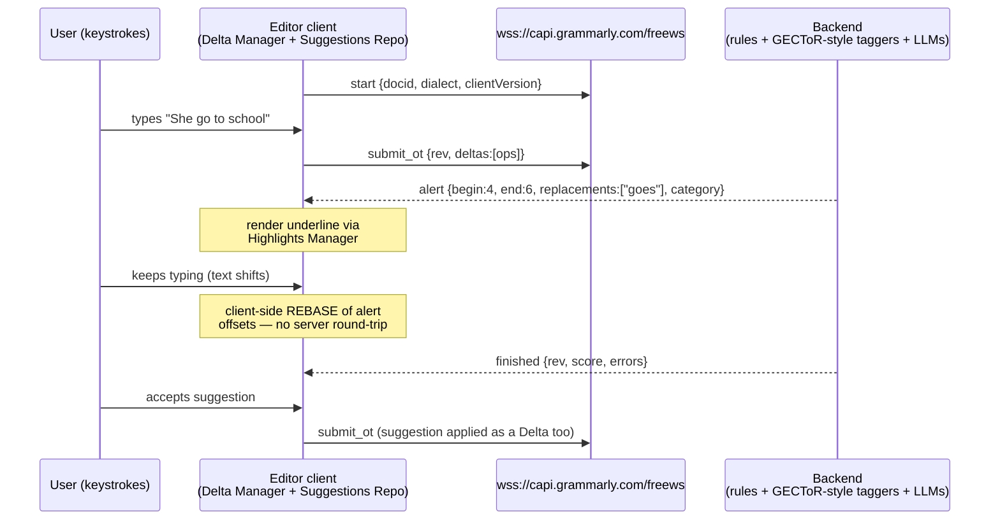
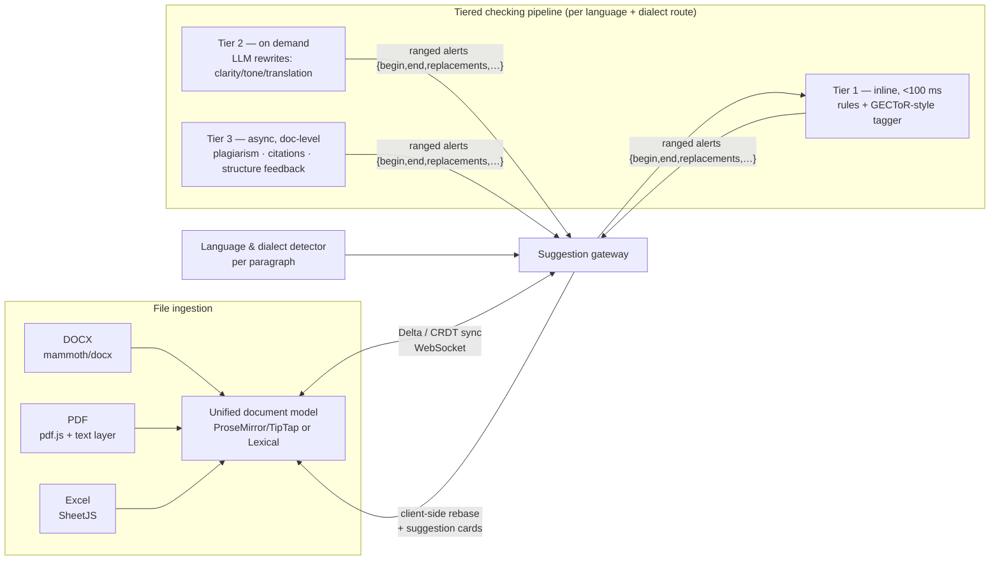

# How Grammarly Works — Web Product & Architecture Analysis

> **Scope note.** This report focuses on Grammarly's **website and web editor** (grammarly.com / app.grammarly.com) and the backend/NLP that powers it. The macOS and Windows desktop apps are intentionally **out of scope** for this version (to be analyzed separately later, per project direction). The goal is to inform the design of a competing, multilingual (English US/UK + Spanish Spain/Latin America) writing assistant for university students, with in-browser editing of DOCX/PDF/Excel files.
>
> **Last researched:** 2026-06-12. Where claims could change quickly (pricing, product names), this is flagged.

---

## Özet (Türkçe)

- Grammarly'nin web ürünü bulut tabanlı bir zengin-metin editörüdür (`app.grammarly.com`). Metin tarayıcıda değil **sunucuda** denetlenir: istemci, düzenlemeleri **WebSocket** (`capi.grammarly.com`) üzerinden artımlı **delta**'lar halinde gönderir; sunucu, karakter aralıkları ve düzeltme önerileri içeren "alert" mesajları döndürür.
- Gerçek zamanlı his, **operasyonel dönüşüm (OT)** tabanlı bir Delta modelinden gelir: siz yazmaya devam ederken istemci, mevcut önerilerin konumlarını **kendi tarafında rebase ederek** kaydırır — sunucunun yeniden analiz etmesini beklemez. Taklit edilmesi gereken çekirdek desen budur.
- NLP katmanı hibrittir: kurallar + hızlı **GECToR** tarzı etiketleme modelleri (seq2seq'ten ~10× hızlı, <100 ms hedef) + talep üzerine çalışan **LLM** yeniden yazımları.
- **Kritik düzeltme:** Grammarly artık yalnızca İngilizce değil — ~23 dilde (İspanyolca dahil: İspanya/Meksika/Arjantin) yazım desteği veriyor. **Ancak bölgesel varyantları gerçekten ayırt etmiyor** ("does not recognize language variations"). Sizin farkınız tam burada: gerçek **lehçe-duyarlı** motor (EN US/UK + ES İspanya/LatAm).
- Web editörü yalnızca DOC/DOCX/ODT/TXT/RTF kabul ediyor (100.000 karakter / 4 MB sınırı); **PDF, Excel, LaTeX, Markdown yok**. Tarayıcıda PDF/Excel düzenleme + canlı denetim vizyonunuz, Grammarly'nin hiç girmediği bir alan.
- Geliştirici SDK'sı Ocak 2024'te kapatıldı — gömülebilir motor/API alanı da boş.

---

## 0. Executive summary

- Grammarly's web product is a **cloud rich-text editor** (`app.grammarly.com`) plus a marketing/account site. Text is checked **server-side**: the client streams incremental edits to a backend over **WebSocket** (`capi.grammarly.com`), and the server pushes back suggestions ("alerts") with character ranges and replacements.
- The real-time feel comes from an **operational-transformation (OT) protocol built on a "Delta" format** (insert / delete / retain ops). The **client** keeps suggestions aligned to the moving text by *rebasing* their positions locally as you keep typing, so it never has to wait for the backend to re-run.
- The NLP stack is a **hybrid**: rule-based checks + ML sequence models (Grammarly's own **GECToR**, a "tag, not rewrite" grammatical-error-correction tagger that is ~10× faster than seq2seq) + newer **LLM-powered generative features** (formerly *GrammarlyGO*, now folded into the AI assistant).
- **Big correction to a common assumption:** Grammarly is **no longer English-only.** As of 2026 it advertises **full writing support in ~23 languages including Spanish (Spain, Mexico, Argentina)**. However, it explicitly **does not tailor regional variants** ("does not recognize language variations") — this is the real gap a competitor can exploit, not the absence of Spanish entirely.
- The web editor **only ingests word-processor formats** (DOC/DOCX/ODT/TXT/RTF), with a **100,000-character / 4 MB limit**, and **does not support PDF, LaTeX, Markdown, or Excel**. There is no spreadsheet or PDF editing surface at all — a wide-open differentiation area.
- **Corporate context (2025):** Grammarly acquired **Coda** (Dec 2024) and **Superhuman** (July 2025), and in **Oct 2025 rebranded the *company* to "Superhuman."** The Grammarly *product* still exists, but now sits inside a "Superhuman suite" alongside Coda, Superhuman Mail, and a new agentic assistant, **Superhuman Go**.

---

## 1. Product family (web) & pricing

### Web-facing products
- **`grammarly.com`** — marketing site, account signup, feature landing pages (plagiarism checker, AI detector, translation, languages).
- **`app.grammarly.com`** — the authenticated **web editor / dashboard**: document list, upload, the editing surface, goals, scores, and reports.
- **Browser extension & desktop apps** exist but are out of scope here.

### Pricing tiers (2026, subject to change)
| Tier | Price | What it adds |
|------|-------|--------------|
| **Free** | $0 | Core spelling/grammar/punctuation, tone detection, ~**100 AI prompts/month** |
| **Pro** | ~**$12/mo billed annually**, **$30/mo** monthly | ~**2,000 AI prompts/mo**, full-sentence rewrites, plagiarism detection, tone/brand/style features; team plans up to ~149 members |
| **Enterprise** | Custom | Centralized admin, security/analytics, policy controls, **unlimited AI prompts**; 150+ seats |

*(Prices vary by source and promotion; treat as approximate. Sources disagree on exact AI-prompt counts — verify against grammarly.com/plans before quoting.)*

### Language support — corrected picture
- **Full writing support: ~23 languages**, incl. English (American/British), **Spanish (Spain), Spanish (Mexico), Spanish (Argentina)**, French, German, Italian, Portuguese (Brazil/Portugal), Dutch, Polish, Ukrainian, Turkish, Hindi, Korean, Vietnamese, and more.
- **Tiered by feature:**
  - **Red underlines** (spelling + basic grammar): all ~23 languages.
  - **Blue underlines** (advanced grammar, clarity, fluency, tone) **and paragraph-level rewrites**: only **English, Spanish, French, German, Portuguese, Italian**.
  - **Translation**: ~19 languages.
- **English dialects:** American, British, Canadian, Australian, Indian (spelling/grammar/punctuation differences).
- **Key limitation (the gap):** Grammarly states it **"does not recognize language variations"** — the three Spanish entries share generalized models rather than truly distinct LatAm-vs-Spain norms (e.g., *voseo*, regional lexicon, ustedes-vs-vosotros register).

---

## 2. Web editor architecture

### The editing surface
- A **cloud rich-text editor**. You either **create a new doc** or **upload** one; documents are stored in your Grammarly account.
- The redesigned editor presents issues as **red/yellow underlines**; clicking opens an **interactive suggestion card** (accept / dismiss via trash / report via flag / add to personal dictionary). The assistant icon **animates in a circle** while checking, so you can keep typing during analysis.
- Extras: writing **goals** + document-type selection, a **statistics/insights** panel, **PDF report** export, and **bulk-dismiss** of whole suggestion categories.

### Document upload / download — formats & limits
- **Accepted:** `.doc`, `.docx`, `.odt`, `.txt`, `.rtf`.
- **Not accepted:** **PDF, LaTeX, Markdown** (and no spreadsheet/Excel surface at all).
- **Limits:** **< 100,000 characters** (incl. spaces) and **≤ 4 MB** per document.
- **Round-trip:** exports back to the **same format** you uploaded; complex formatting can shift on export (a known complaint).

### Grammarly Text Editor SDK (deprecated)
- Grammarly once offered a **Text Editor SDK** ("Grammarly for Developers") that let third-party web apps embed Grammarly's checking into their own `textarea`/`contenteditable` fields.
- It was **shut down on 2024-01-10**; integrations stopped working after that date. Grammarly cited refocusing engineering on its **core product + generative AI**. *Implication: there is no longer an official way to embed Grammarly's engine — a competitor SDK is now an open niche.*

---

## 3. Client–server protocol (how real-time checking actually works)

Grammarly does **not** run grammar models in the browser; it streams text to a backend and renders what comes back. The protocol is documented through multiple independent reverse-engineering projects and Grammarly's own engineering blog.

### Transport & handshake
- **WebSocket endpoint:** `wss://capi.grammarly.com/freews`.
- **Auth via cookies:** `grauth` (session), `csrf-token`, `gnar_containerId`. Anonymous/free sessions get a token through a cookie flow.
- **Message envelope:** every message has an incrementing `id`, an `action` (RPC-style function name), and a `rev` revision number.

### Message flow
1. **`start`** — opens a document session. Parameters include `client` (e.g. `extension_chrome`), `clientVersion`, **`dialect`** (e.g. `american`), `docid` (UUID), `protocolVersion`, and an auth `token`.
2. **`submit_ot`** — sends text as **operational-transform deltas** (a `ch` array of ops like position/length/content/type). Edits are streamed incrementally rather than re-sending the whole document.
3. **`alert`** (server → client, repeated) — one per detected issue: `begin`/`end` character offsets, `replacements` (suggested fixes), `point` (rule id), `category` (e.g. `BasicPunct`), `impact`/severity, plus HTML explanation/examples.
4. **`finished`** — end of a diagnostics pass, with a `score`, `errors` count, `dialect`, and doc statistics.
- Additional actions cover options/config and feedback.

### End-to-end flow



### Illustrative message shapes (simplified from reverse-engineering writeups)

```jsonc
// client → server: open a session
{ "id": 0, "action": "start", "client": "denali_editor",
  "clientVersion": "1.5.43", "dialect": "american",
  "docid": "6c231c-...-uuid", "protocolVersion": "1.0.0" }

// client → server: incremental edit as OT delta
{ "id": 1, "action": "submit_ot", "rev": 0, "doc_len": 0,
  "deltas": [ { "ops": [ { "insert": "She go to school" } ] } ] }

// server → client: one suggestion ("alert")
{ "action": "alert", "id": 2, "rev": 0,
  "begin": 4, "end": 6, "text": "go",
  "replacements": ["goes"],
  "category": "Grammar", "point": "SVAgreement",
  "impact": "critical",
  "explanation": "<p>The verb <b>go</b> does not agree with the subject…</p>" }

// server → client: pass complete
{ "action": "finished", "id": 3, "rev": 0,
  "score": 62, "dialect": "american",
  "outcomeScores": { "Clarity": 0.5, "Correctness": 0.4 } }
```

*(Field names/values are representative — assembled from the cited unofficial API docs; Grammarly's production protocol has evolved since those writeups.)*

### Keeping suggestions aligned while you type (the clever part)
Grammarly's engineering writeups describe a production OT system built on a **Delta format** with three op types — **`insert`, `delete`, `retain`** — used uniformly for user edits *and* ML suggestions. Three client components cooperate:
- **Suggestions Repository** — central store of active backend suggestions; tracks each as *registered / applied / removed*.
- **Delta Manager** — performs the **rebase**: as the user keeps editing, it recomputes each suggestion's offsets by rebasing its Delta onto the accumulating composed Delta. This is **client-side**, so suggestions stay correctly positioned **without waiting for the backend** to re-infer.
- **Highlights Manager** — renders underlines/highlights; ensures cards never flicker or point at the wrong span.
- **Batch application** composes multiple suggestion Deltas into one transaction before applying, to avoid UI freezes.
- The client also **invalidates** a suggestion if the user independently fixes that issue.

### Scale & latency (from Grammarly engineering blog)
- Serves on the order of **30M daily active users**; aims for **sub-100 ms** inference latency, distributing inference dynamically across servers.
- Infra evolved **EC2 → EKS (Kubernetes)**, decoupling storage from compute; multi-region on AWS using **Transit Gateways** for cross-region/VPC routing, scaling toward 5+ regions for low latency.

---

## 4. Backend NLP / ML

### GECToR — "Tag, Not Rewrite" (Grammarly Research, BEA-2020)
- Core idea: treat grammatical error correction as **sequence tagging**, not seq2seq rewriting. A BERT-like **Transformer encoder** + two linear heads (error **detection** + token **tagging**) predicts per-token edits: `KEEP`, `DELETE`, `APPEND_t`, `REPLACE_t`, plus custom **g-transformations** (verb tense, number, case, etc.).
- Coverage: top-100 basic tags ≈ **60%** of errors; adding g-transformations ≈ **80%**.
- Quality/speed: **F0.5 ≈ 65.3 (single) / 66.5 (ensemble)** on CoNLL-2014, **72.4 / 73.6** on BEA-2019; **up to ~10× faster** inference than seq2seq. Open-sourced at `github.com/grammarly/gector`.
- This is the archetype for **low-latency, real-time** correction — directly relevant to a competitor's design.

### Hybrid pipeline
- Grammarly combines **linguist-authored rules** + **statistical/ML models** + **deep learning**, evolving rules → ML → transformers → LLMs. Auxiliary models cover **tone detection**, **clarity/conciseness rewrites**, and main-point/extraction tasks (per their NLP/ML blog).
- Recent direction: **on-device models** for faster/cheaper/more-private inference (engineering blog), alongside server models.

### Generative AI (GrammarlyGO → "Grammarly AI" → Superhuman Go)
- **GrammarlyGO** launched **March 2023**: prompt-based composition, rewrite for tone/clarity/length, ideation/outlines, context-aware email replies. Prompt counts are **metered by tier** (≈100 free / ≈2,000 Pro / unlimited Enterprise).
- After the 2025 rebrand, the agentic assistant **Superhuman Go** brings proactive suggestions across apps and can connect to Jira/Gmail/Drive/Calendar to take actions.

### Plagiarism, AI detection, citations (student-relevant)
- **Plagiarism checker (paid):** compares text against **16B+ web pages/articles**, returns an **originality %** and source links. **Weakness:** lacks access to **institutional/journal databases** that Turnitin uses, and reportedly weaker on **long-form** academic text.
- **AI detector:** Grammarly markets **~99% accuracy** and a top RAID-benchmark rank; **"Authorship"** categorizes text by origin (AI / database / typed by you). *(Vendor-reported accuracy — treat skeptically; independent AI detectors are broadly unreliable.)*
- **Citations:** generates preformatted **APA / MLA / Chicago** citations.

---

## 5. Feature analysis — free vs paid (web)

| Capability | Free | Pro / Enterprise |
|---|---|---|
| Spelling, grammar, punctuation | ✅ | ✅ |
| Tone detection | ✅ | ✅ |
| Clarity / conciseness / full-sentence rewrites | Limited | ✅ |
| Generative AI prompts | ~100/mo | ~2,000/mo → unlimited (Ent.) |
| Plagiarism checker | ❌ | ✅ |
| AI detector / Authorship | Limited | ✅ |
| Citations (APA/MLA/Chicago) | Limited | ✅ |
| Team style guides / brand tones / admin | ❌ | ✅ |

---

## 6. Implications for the planned product

What Grammarly does well (and you must match):
1. **Server-streamed, incremental checking over WebSocket** with **client-side OT rebasing** so suggestions never lag the cursor. This is the core UX bar — replicate the **Delta (insert/delete/retain) + rebase** pattern.
2. **Tagging-style correction (GECToR)** for **sub-100 ms** latency instead of slow full-sentence LLM rewrites on every keystroke. Use a **fast tagger for inline corrections** and reserve **LLMs for on-demand rewrites/explanations**.
3. **Clear suggestion-card UX** (accept/dismiss/explain, personal dictionary, bulk-dismiss, goals, scores).

Where Grammarly is **weak** — your differentiation:
1. **No true regional variants.** Grammarly explicitly "does not recognize language variations." A genuinely **dialect-aware** engine — **English US vs UK** *and* **Spanish Spain (vosotros/leísmo) vs Latin America (voseo, ustedes, regional lexicon)** — is a concrete, defensible edge for university users.
2. **No PDF / Excel / LaTeX / Markdown.** Grammarly only round-trips word-processor files under a 100k-char / 4 MB cap. Your vision of **in-browser editing of DOCX/PDF/Excel** with live checking is something Grammarly simply does not offer.
3. **No embeddable engine anymore** (SDK killed Jan 2024) — room for an integration/API play.
4. **Plagiarism limited to web** (no institutional DBs) and **AI-detection claims are vendor-reported** — be honest here rather than over-promising.

### Head-to-head: Grammarly web vs. the planned product

| Dimension | Grammarly (web, 2026) | Planned product (target) |
|---|---|---|
| Dialect awareness | ❌ "does not recognize language variations" | ✅ EN-US/EN-GB + ES-ES/ES-419 as first-class, separately modeled variants |
| Spanish quality | Generalized models shared across ES variants | Voseo, vosotros/ustedes register, regional lexicon handled explicitly |
| File formats | DOC/DOCX/ODT/TXT/RTF only; 100k chars / 4 MB | DOCX + **PDF + Excel** (+ Markdown/LaTeX later), edited in-browser |
| Editing surface | Own cloud editor only | Word/Excel/Acrobat-grade editing on uploaded files, same checking pipeline everywhere |
| Academic workflow | Generic goals/scores; citations as add-on | University-assignment-first: rubric goals, citation styles, structure/argument feedback |
| Embeddability | SDK shut down Jan 2024 | API/SDK as a deliberate product surface |
| Real-time core | WebSocket + OT Delta + client rebase (excellent) | Match it — same pattern, no compromise |

### Target architecture (web)



### Architectural recommendations (web)
- **Editor surface:** build on a modern document model — **ProseMirror/TipTap** (rich text, collaborative-friendly) or **Lexical** — so suggestion overlays attach to a stable position map rather than raw DOM offsets.
- **Sync layer:** adopt a **Delta/OT or CRDT** model (e.g., Yjs/Automerge or a Quill-Delta-style format) so user edits and AI suggestions share one representation and suggestions **rebase client-side**.
- **Suggestion protocol:** stream incremental deltas to the backend over **WebSocket**; return ranged alerts `{begin, end, replacements, category, severity, explanation}` — mirror Grammarly's proven shape.
- **Model tiering for latency + cost:**
  - *Tier 1 (inline, <100 ms):* fast **sequence-tagging GEC** per language/dialect (GECToR-style), plus deterministic rules for punctuation/spelling.
  - *Tier 2 (sentence/paragraph, on demand):* instruction-tuned **LLM rewrites** for clarity/tone/translation, with per-dialect prompting.
  - *Tier 3 (document, async):* plagiarism/originality, citation generation, structure/argument feedback for essays.
- **File handling:** server-side converters — **DOCX** (e.g., docx/mammoth), **PDF** (pdf.js for view + a text-layer/redaction-edit model), **Excel** (SheetJS) — mapping each into the editor's document model so the *same* checking pipeline runs on any file type.
- **Multilingual from day one:** language/dialect detection per paragraph, per-dialect model routing, and a configurable dialect setting (US/UK; ES-ES / ES-419 with country sub-variants).

> **Boundary note (humanizer / AI-detection evasion).** The brief mentioned a "humanizer so even professors can't tell." Building a tool whose purpose is to **defeat academic-integrity/AI-detection systems** would facilitate academic dishonesty, so this report does not design that. The legitimate, supportable analogue is **transparent writing assistance** — paraphrasing, tone/clarity rewrites, translation, and citation help that *improve a student's own work* — which is exactly where Grammarly's paraphrasing/tone features sit and where a stronger, dialect-aware product can compete openly.

---

## Sources

- Grammarly Support — upload/limitations: https://support.grammarly.com/hc/en-us/articles/115000090232 · https://support.grammarly.com/hc/en-us/articles/115000090911 · https://support.grammarly.com/hc/en-us/articles/115000091352
- New Grammarly Editor: https://www.grammarly.com/blog/product/new-grammarly-editor/
- Languages: https://www.grammarly.com/languages · https://support.grammarly.com/hc/en-us/articles/115000090971
- English dialects: https://support.grammarly.com/hc/en-us/articles/115000089992
- WebSocket API (reverse-engineered): https://github.com/dexterleng/grammarly-api/blob/master/api-docs.md · https://github.com/stewartmcgown/grammarly-api · https://znck.dev/articles/2019-06-03-grammarly-in-code/ · https://support.grammarly.com/hc/en-us/articles/115000090731
- Real-time OT/Delta architecture: https://www.zenml.io/llmops-database/production-scale-nlp-suggestion-system-with-real-time-text-processing
- Infra/scale: https://www.grammarly.com/blog/engineering/scaling-aws-infrastructure/ · https://www.grammarly.com/blog/engineering/ml-infrastructure-research-experimentation/ · https://www.grammarly.com/blog/engineering/on-device-models-scale/
- GECToR: https://www.grammarly.com/blog/engineering/gec-tag-not-rewrite/ · https://arxiv.org/abs/2005.12592 · https://github.com/grammarly/gector
- Text Editor SDK shutdown: https://techcrunch.com/2023/07/13/grammarly-to-shut-down-the-text-editor-sdk-in-january/
- GrammarlyGO / generative AI: https://www.demandsage.com/grammarlygo/ · https://synthedia.substack.com/p/grammarly-to-add-generative-ai-writing
- Plagiarism / AI detector / citations: https://www.grammarly.com/plagiarism-checker · https://www.grammarly.com/ai-detector · https://originality.ai/blog/grammarly-plagiarism-checker-review
- Pricing: https://www.grammarly.com/plans · https://checkthat.ai/brands/grammarly/pricing · https://www.eesel.ai/blog/grammarly-pricing
- Superhuman rebrand / acquisitions: https://techcrunch.com/2025/10/29/grammarly-rebrands-to-superhuman-launches-a-new-ai-assistant/ · https://www.grammarly.com/blog/company/announcing-company-rebrand-to-superhuman/ · https://help.coda.io/hc/en-us/articles/40685056076685
